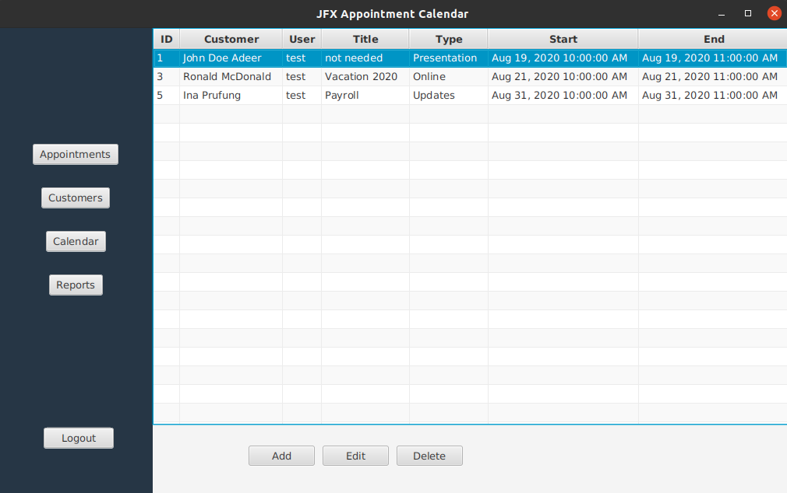
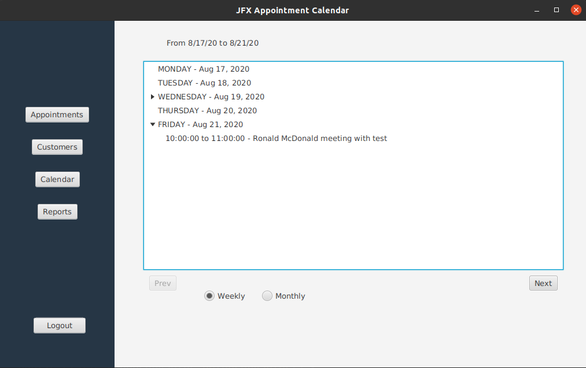

# JavaFX Appointment Calendar

A database backed desktop application to create and manage appointments, and customers
across different time zones.

The application includes:
- UI for creating, updating, deleting customers and appointments on MySQL database
- Appointment time zone conversions to user's local time zone
- Calendar view for appointments by week and month
- Alert notifications 15 minutes prior to user appointment start time
- Internationalization and localization support for French readers

